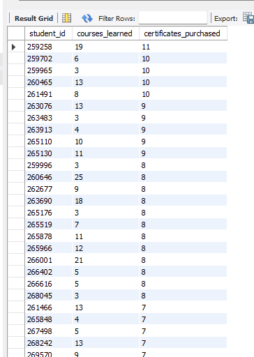
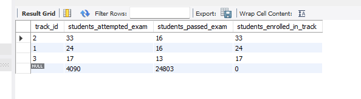
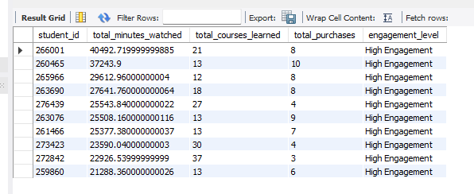

## Which courses have the highest student engagement and best ratings?
```
SELECT
    ci.course_id,
    ci.course_title,
    sl_summary.total_learners,
    sl_summary.total_hours_watched,
    cr_summary.avg_course_rating
FROM course_info ci
LEFT JOIN (
    SELECT
        course_id,
        COUNT(DISTINCT student_id) AS total_learners,
        round(SUM(minutes_watched) / 60, 2) AS total_hours_watched
    FROM student_learning
    GROUP BY course_id
) sl_summary ON ci.course_id = sl_summary.course_id
LEFT JOIN (
    SELECT
        course_id,
        ROUND(AVG(course_rating), 2) AS avg_course_rating
    FROM course_ratings
    GROUP BY course_id
) cr_summary ON ci.course_id = cr_summary.course_id
ORDER BY
    sl_summary.total_hours_watched DESC,
    cr_summary.avg_course_rating DESC;
```
## Output:


## Key Insight:
- Courses with the highest total hours watched show the strongest learner engagement.
- High average ratings indicate strong learner satisfaction with the course content.
- Courses ranking high in both engagement and ratings represent the most successful learning content.
- The analysis helps identify which courses attract the most learners and deliver the best experience.


## Which courses have the highest student completion rates and what is the average time students spend on them?
```
SELECT
    sl.course_id,
    ci.course_title,
    COUNT(DISTINCT sl.student_id) AS total_students,

    COUNT(DISTINCT CASE
        WHEN sl.minutes_watched >= ci.course_duration
        THEN sl.student_id
    END) AS students_completed,

    ROUND(
        COUNT(DISTINCT CASE
            WHEN sl.minutes_watched >= ci.course_duration
            THEN sl.student_id
        END) * 100.0 /
        COUNT(DISTINCT sl.student_id),
    2) AS completion_rate,

    ROUND(AVG(sl.minutes_watched),2) AS avg_minutes_watched

FROM student_learning sl
JOIN course_info ci
    ON sl.course_id = ci.course_id

GROUP BY
    sl.course_id,
    ci.course_title

ORDER BY
    completion_rate DESC;
```
## Output


## Key Insight:
- Courses with higher completion rates indicate strong learner engagement and effective course design.
- Some courses attract many students but show lower completion rates, suggesting potential improvements in content or structure.
- Average minutes watched highlights overall learner engagement with the course material.
- Courses with high completion rates and high watch time represent the most successful learning experiences.

## Which students are most engaged, having taken at least 3 courses, and how many certificates have they purchased?
```
SELECT
    sl.student_id,
    COUNT(DISTINCT sl.course_id) AS courses_learned,
    COUNT(DISTINCT sp.purchase_id) AS certificates_purchased
FROM student_learning sl
LEFT JOIN student_purchases sp
    ON sl.student_id = sp.student_id
GROUP BY
    sl.student_id
HAVING
    COUNT(DISTINCT sl.course_id) >= 3
ORDER BY
    certificates_purchased DESC;
```
## Output


## Key Insight:


4. For each career track, how many students attempted the exams, how many passed, and how many are enrolled in the track?
```
SELECT
    ei.track_id,
    COUNT(DISTINCT se.student_id) AS students_attempted_exam,

    SUM(CASE 
        WHEN se.exam_passed = 1 THEN 1 
        ELSE 0 
    END) AS students_passed_exam,

    COUNT(DISTINCT CASE 
        WHEN scte.student_id IS NOT NULL 
        THEN se.student_id 
    END) AS students_enrolled_in_track

FROM student_exams se
JOIN exam_info ei
    ON se.exam_id = ei.exam_id

LEFT JOIN student_career_track_enrollments scte
    ON se.student_id = scte.student_id
    AND ei.track_id = scte.track_id

GROUP BY
    ei.track_id
ORDER BY
    students_enrolled_in_track DESC;
```


5. How engaged are students based on total time spent learning, number of courses completed, and purchases made?
```
SELECT
    sl.student_id,
    SUM(sl.minutes_watched) AS total_minutes_watched,
    COUNT(DISTINCT sl.course_id) AS total_courses_learned,
    COUNT(DISTINCT sp.purchase_id) AS total_purchases,

    CASE
        WHEN SUM(sl.minutes_watched) >= 500 THEN 'High Engagement'
        WHEN SUM(sl.minutes_watched) BETWEEN 200 AND 499 THEN 'Medium Engagement'
        ELSE 'Low Engagement'
    END AS engagement_level

FROM student_learning sl
LEFT JOIN student_purchases sp
    ON sl.student_id = sp.student_id

GROUP BY
    sl.student_id
ORDER BY
    total_minutes_watched DESC;
```

