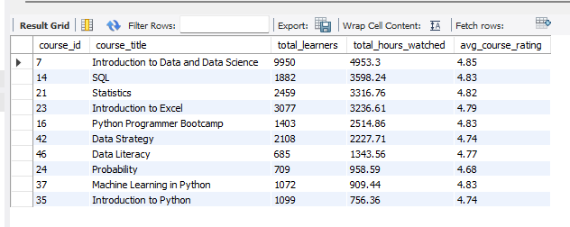
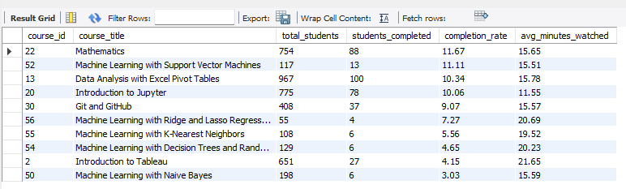

-- 1. Which courses have the highest student engagement and best ratings?
```
SELECT
    ci.course_id,
    ci.course_title,
    sl_summary.total_learners,
    sl_summary.total_hours_watched,
    cr_summary.avg_course_rating
FROM course_info ci
LEFT JOIN (
    SELECT
        course_id,
        COUNT(DISTINCT student_id) AS total_learners,
        round(SUM(minutes_watched) / 60, 2) AS total_hours_watched
    FROM student_learning
    GROUP BY course_id
) sl_summary ON ci.course_id = sl_summary.course_id
LEFT JOIN (
    SELECT
        course_id,
        ROUND(AVG(course_rating), 2) AS avg_course_rating
    FROM course_ratings
    GROUP BY course_id
) cr_summary ON ci.course_id = cr_summary.course_id
ORDER BY
    sl_summary.total_hours_watched DESC,
    cr_summary.avg_course_rating DESC;
```
-- Output:



2. Which courses have the highest student completion rates and what is the average time students spend on them?
```
SELECT
    sl.course_id,
    ci.course_title,
    COUNT(DISTINCT sl.student_id) AS total_students,

    COUNT(DISTINCT CASE
        WHEN sl.minutes_watched >= ci.course_duration
        THEN sl.student_id
    END) AS students_completed,

    ROUND(
        COUNT(DISTINCT CASE
            WHEN sl.minutes_watched >= ci.course_duration
            THEN sl.student_id
        END) * 100.0 /
        COUNT(DISTINCT sl.student_id),
    2) AS completion_rate,

    ROUND(AVG(sl.minutes_watched),2) AS avg_minutes_watched

FROM student_learning sl
JOIN course_info ci
    ON sl.course_id = ci.course_id

GROUP BY
    sl.course_id,
    ci.course_title

ORDER BY
    completion_rate DESC;
```


